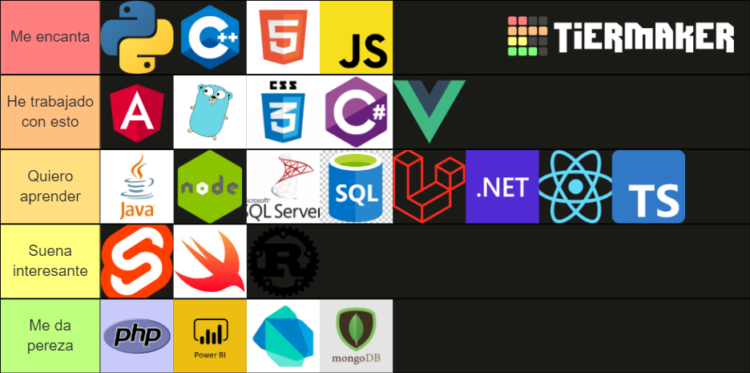

<!--Conteo de personas que ven mi perfil-->

  

<h1 align="center">• ─── ⋆⋅☆⋅⋆ ─── •</h1>
<h1 align="center"> Hi! I'm Mike Gabriel </h1>
<h3 align="center">‍💻 A engineering student in software and programming 👨‍💻</h3>
<h1 align="center">•❅──✧❅✦❅✧──❅•</h1>
</a>
<!--Animación uwu -->

<!--Redes Sociales-->

### Social Networks: 

  
<a href="https://www.instagram.com/dev_mikee/" target="_blank">

  
<a href="https://youtube.com/@devmikee" target="_blank">
 
  
<a href="https://twitter.com/Devmikee" target="_blank">
 

<a href="https://www.linkedin.com/in/miguel-gabriel-hern%C3%A1ndez/" target="_blank">
 

<a href="https://www.twitch.tv/devmikee" target="-blank">
 
 
<a href="https://discord.gg/uTGDBd2jgr" tarjet="-blank">

             

  

  

  
   
  
   
<!--Aprendizaje-->

I am currently learning **VueJS, NodeJS, Laravel and Python**    

 You can visit my website for more information [click here](https://miportafoliomike.netlify.app/)

 You can contact me by mail [click here](mailto:mikealesso768gmail.com)
  
<!--Frameworks-->
  
<h3 align="left">My framework list:</h3>
 

 
<!--Mis lenguajes fav-->
  
<h3 align="left">Languages and Tools I use:</h3>

<a href="https://www.w3.org/html/" target="_blank">  </a>    

  
<!--Mi progeso en Github-->
  
<h3 align="left">My progress:</h3> 
 

